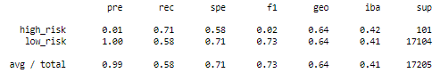
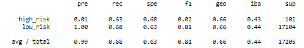
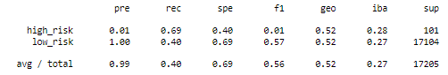
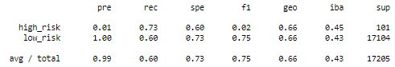
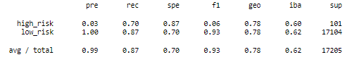
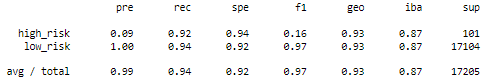

# Credit Risk Analysis

## Project Overview
This is a machine learning project that predicts credit risk in loan applicants. By employing supervised machine learning algorithms, we can resample, train, and test our model, and compare the performance of each of the algorithms in the accuracy of accurately predicting credit risk. 

The algorithms used for this project include RandomOverSampler, SMOTE, ClusterCentroids, SMOTEENN, as well as ensemble classifiers including BalancedRandomForestClassifier and EasyEnsembleClassifier. 

## Results
//Using bulleted lists, describe the balanced accuracy scores and the precision and recall scores of all six machine learning models. Use screenshots of your outputs to support your results.

- RandomOverSampler:
    - Accuracy: 64.6%
    - Precision: 0.99%
    - Recall: 71.3%

- SMOTE:
    - Accuracy: 65.9%
    - Precision: 1.2%
    - Recall: 63.4%

- ClusterCentroids:
    - Accuracy: 66.7%
    - Precision: 0.67%
    - Recall: 69.3%

- SMOTEENN:
    - Accuracy: 54.4%
    - Precision: 1.1%
    - Recall:  73.3%

- BalancedRandomForestClassifier:
    - Accuracy: 78.9%
    - Precision: 3.2%
    - Recall: 70.3%

- EasyEnsembleClassifier:
    - Accuracy: 93.1%
    - Precision: 8.6%
    - Recall: 92.1%

## Summary
//Summarize the results of the machine learning models, and include a recommendation on the model to use, if any. If you do not recommend any of the models, justify your reasoning.